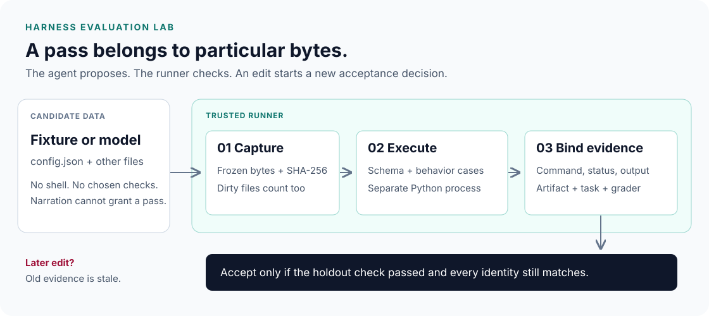

# Harness evaluation lab

Understand why an agent saying “done” is different from a runner proving that a
particular artifact passed its checks. Start with a deterministic simulation,
execute real checks without a model, then optionally measure an LLM with and
without check feedback.

Companion to [Harness Engineering for AI Agents](https://slavadubrov.github.io/blog/2026/07/22/ai-agent-harness-engineering/).
The article's [pinned revision `517353f3`](https://github.com/slavadubrov/harness-demo/tree/517353f3a47541d66099983170fe90812b6ef23b)
reproduces the original simulation. The measured lanes below are a later addition.



## Start here

Install [uv](https://docs.astral.sh/uv/getting-started/installation/). Python 3.11+
and Git are required; Ubuntu 24.04 is the CI target, and macOS is also supported.
From this checkout:

```bash
uv sync --locked --extra live
make check
make run
make fixtures
```

Installation downloads dependencies. The checks and these demos are offline;
no API key is read. `--extra live` installs the SDK so its mocked transport tests
also run. A minimal installation uses `uv sync --locked` and can run both offline
lanes without the SDK. `make check` runs Ruff (including imports and formatting),
strict mypy, and unittest; `make run` preserves the original simulator command.

| Lane | Command | What the result establishes |
| --- | --- | --- |
| Simulation | `uv run --locked harness-ablation` | Declared causal assumptions across 12 synthetic tasks; all tokens and outcomes are simulated. |
| Fixture | `uv run --locked harness-eval fixture fixtures/passing` | A trusted Python check actually passed on these exact submitted bytes. |
| Live | `harness-eval live …` below | A real model proposed configurations scored by the same runner, under recorded settings and budgets. |

A **harness** owns the loop around the model: instructions, checks, feedback,
budgets and stopping. An **evaluation harness** fixes the tasks and grading
rules, runs alternatives, and records comparable evidence. Here the two live
alternatives differ only in whether public check feedback reaches the model.

## See an actual failure

```bash
uv run --locked harness-eval fixture fixtures/failing --output report/failure.json
```

This deliberately exits **1**, even though `agent-claim.txt` says all tests passed.
The good fixture exits **0**. Invalid CLI/setup inputs exit **2**. A completed live
experiment also exits 1 if any planned trial fails or is not run; the JSON report
distinguishes a bad answer from a provider or runner failure.

The artifact is a directory containing `config.json`, for example:

```json
{"strip": true, "case": "lower", "separator": "-"}
```

The trusted interpreter applies these operations to strings: trim, change case,
and optionally join whitespace-separated words. For the `slug` task,
`" Hello WORLD "` must become `"hello-world"`. The runner checks strict configuration
shape and all held-out cases. Candidates cannot supply commands or disable checks.
Additional submitted files are hashed but never executed. This is a real check
of a small declarative artifact, **not a general coding-agent benchmark**.

To see why a later edit invalidates a pass, run the walkthrough in
[Evaluation contracts](docs/evaluation.md#an-edit-invalidates-the-pass).

## Run a small LLM experiment

Put `OPENAI_API_KEY` in your existing `.env` (see [.env.example](.env.example) for
the variable name). Only the command below loads that file. Restart the CLI command
after changing `.env`; there is no background service to restart.

```bash
uv run --locked --extra live --env-file .env harness-eval live \
  --model gpt-5.6-luna --task slug --trials 1 \
  --max-output-tokens 1024 --output report/first-live.json
```

This is billable: **at most 4 requests**, each capped at 1,024 generated tokens
(including reasoning). Input tokens are billed too. The report records actual
usage when supplied by the provider; a failed request's unknown usage is never
reported as zero cost. These are call/output limits, not a dollar spending cap.
The model argument is required; use an accessible pinned snapshot for a repeatable
comparison. Both the requested and returned model IDs are recorded.

Both arms have two attempts, including when attempt one succeeds. `blind-retry`
gets a generic review request; `check-feedback` gets the public check result.
Only the final artifact is scored on holdout cases. A model may get both right
immediately, so **zero improvement is a valid result**. Try `--task all --trials 3`
for 36 planned calls, after reviewing the small run.

Responses use `store=False`, retain encrypted reasoning output between attempts,
and perform no compaction. `--drop-reasoning` changes retention independently;
compaction stays disabled. Provider failures, incomplete streams and refusals
stop the entire experiment without automatic retry. Partial output never becomes
an artifact. Existing live report paths are refused to prevent accidental overwrite.

## Read the implementation

| File | Responsibility |
| --- | --- |
| [model.py](src/harness_ablation/model.py), [cli.py](src/harness_ablation/cli.py) | Pure simulation and its console tables. |
| [suite.py](src/harness_ablation/suite.py) | Three versioned tasks, public examples and held-out cases. |
| [artifacts.py](src/harness_ablation/artifacts.py) | Immutable submitted bytes, manifest hashes and atomic report writes. |
| [grader.py](src/harness_ablation/grader.py) | Trusted standalone configuration validation and behavioral checks. |
| [runner.py](src/harness_ablation/runner.py) | Isolated Python execution, evidence and stale-pass rejection. |
| [provider.py](src/harness_ablation/provider.py) | Optional OpenAI transport; complete responses or terminal failures. |
| [experiment.py](src/harness_ablation/experiment.py) | Fixed two-attempt comparisons, budgets, histories and trial accounting. |
| [eval_cli.py](src/harness_ablation/eval_cli.py) | CLI arguments, configuration and exit codes. |

Next: [evaluation method and extension recipe](docs/evaluation.md),
[simulation assumptions and original tables](docs/simulation.md).

## Why a separate repository?

[Market Analyst Agent](https://github.com/slavadubrov/market-analyst-agent) demonstrates
an application: tools, graph execution, memory, report review and recovery. This
lab isolates evaluation contracts so a new reader does not need market data,
Redis, Postgres, Qdrant or LangGraph to understand acceptance and controlled
comparisons. Keep the repositories separate. An application-specific evaluation
can reuse this method with its own report artifacts and trusted grading rules;
there is no shared package or runtime dependency to maintain today.

## Boundaries

The simulator's 100% score is constructed, not an observed agent success rate.
The live suite is tiny, public and synthetic; “held out” means withheld from
requests, not a secret benchmark or proof against training contamination.

The agent receives no filesystem or shell tools. The grader interprets data;
`python -I` is import isolation, not an OS security sandbox. The runner, task
suite, Python installation and local report store are trusted. Evidence JSON is
an audit record, not a signed credential; never accept a model-supplied report
as authorization. Use a dedicated small submission directory, not an entire
repository containing credentials. Arbitrary code evaluation would require a
separate sandbox and a different threat model.
