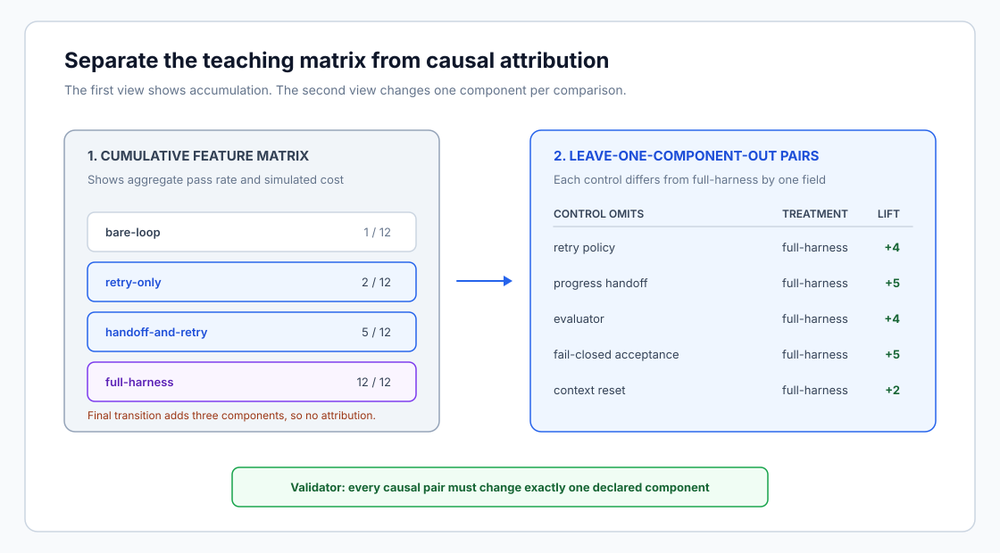

# Harness ablation lab



This project is a small, deterministic lab for the article [Harness Engineering
for AI Agents: Designing the Loop Around the
Model](https://slavadubrov.github.io/blog/2026/06/10/ai-agent-harness-engineering/).

It teaches one method: keep a task suite fixed, switch one harness component at
a time, and record the trade-off. The code has no network calls, model calls,
API keys, Docker containers, or GPUs.

It is **not** a benchmark for model capability or a measurement of a production
agent. The task outcomes and token counts are simulated. Their job is to make
the causal assumptions visible.

## What it simulates

Each of the 12 synthetic tasks declares the conditions that would block success:

- a flaky tool call that needs a bounded retry;
- work that crosses a session boundary and needs a progress handoff;
- a large task that benefits from a fresh-context reset;
- an implementation gap that a fresh evaluator catches;
- an ambiguous "done" claim that needs a fail-closed acceptance check.

The lab first runs the same tasks through four cumulative configurations:

| Configuration | Components switched on |
| --- | --- |
| `bare-loop` | None |
| `retry-only` | Retry policy |
| `handoff-and-retry` | Progress handoff and retry policy |
| `full-harness` | Handoff, retry, evaluator, fail-closed acceptance, context reset |

That matrix is useful for showing the growing cost and aggregate pass rate, but
its final transition adds three components. It cannot attribute the final lift
to any one of them. The lab therefore runs a second set of comparisons. Each
control removes exactly one component from `full-harness`, while the treatment
restores only that component. A validator and regression test reject any pair
that changes more than one declared component.

## Quick start

Install [uv](https://docs.astral.sh/uv/) and run:

```bash
make check
make run
make failures
```

`make check` runs Ruff and the unit tests. `make run` prints the summary matrix.
`make failures` also prints the named reason each synthetic task did not pass.

The result is stable because there is no sampling:

```text
Cumulative harness matrix (synthetic teaching lab)
config             passed  success  avg_attempts  avg_simulated_tokens
-----------------  ------  -------  ------------  --------------------
bare-loop            1/12        8%          1.00                  1738
retry-only           2/12       17%          1.33                  1798
handoff-and-retry    5/12       42%          1.33                  1890
full-harness        12/12      100%          1.33                  2126

Leave-one-component-out ablations
component                 control  treatment  delta
-----------------------  -------  ---------  -----
retry_policy              8/12    12/12       +4
progress_handoff          7/12    12/12       +5
evaluator                 8/12    12/12       +4
fail_closed_acceptance    7/12    12/12       +5
context_reset            10/12    12/12       +2
```

The full configuration costs more simulated tokens. That is deliberate: a
harness feature must earn its cost, latency, and operational complexity.

## Project layout

```text
src/harness_ablation/model.py  Synthetic tasks, configurations, and pure runner
src/harness_ablation/cli.py    Console output and --show-failures flag
tests/test_model.py            Regression tests for the teaching assumptions
assets/harness_lab.svg         Accessible diagram of the two experiment stages
```

The package exposes a `harness-ablation` command, so a future repository can
keep the same interface:

```bash
uv run harness-ablation --show-failures
```

## Turning the lab into a real experiment

Replace `TASKS` with a representative, versioned task suite. Replace
`simulated_tokens` with real trace data. Keep the model, environment, task
definition, and scoring rule fixed while you change one harness feature. The
`AblationPair` validator is a small guardrail against calling a bundled change
an ablation. Track task success, escaped defects, latency, cost, retries, policy
blocks, and human review time.

Do not copy the 100% result into a slide deck. The fake agent is designed to
make the method easy to see. Real agents have the poor manners to be more
interesting.
