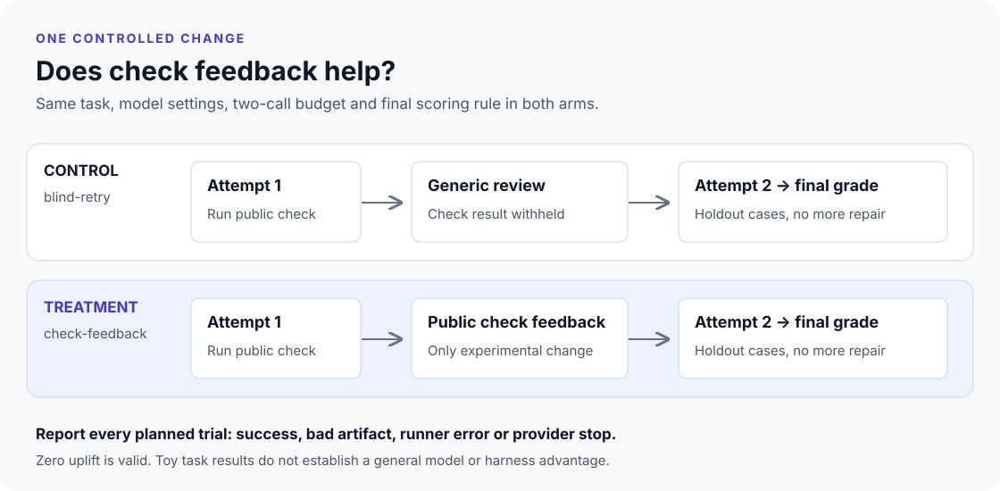

# Evaluation contracts and method

## Follow one run

A task describes the behavior, public examples and separate final scoring cases.
An agent proposes a JSON configuration. The runner captures its bytes, then
starts a separate Python process with a frozen copy of the trusted grader.
The grader checks the schema and executes every case. No verdict is extracted
from agent narration, and no candidate code is imported.



The offline and live paths share this grader. The offline fixtures test the
runner's acceptance contract; the live experiment measures model output. The
original simulator is a third path, deliberately independent of both.

## An edit invalidates the pass

Run from the repository after `uv sync --locked`:

```python
# Save as /tmp/stale_pass.py, then: uv run python /tmp/stale_pass.py
from pathlib import Path
from tempfile import TemporaryDirectory

from harness_ablation.artifacts import capture
from harness_ablation.runner import accepts, grade
from harness_ablation.suite import SUITE

with TemporaryDirectory() as directory:
    root = Path(directory)
    config = root / "config.json"
    config.write_text('{"strip":true,"case":"lower","separator":"-"}')
    snapshot = capture(root)
    evidence = grade(snapshot, SUITE[0])
    assert accepts(root, SUITE[0], evidence)

    config.write_text('{"strip":false,"case":"preserve","separator":"preserve"}')
    assert not accepts(root, SUITE[0], evidence)
    assert grade(snapshot, SUITE[0]).status == "passed"
```

The old bytes still pass. The changed submission has no pass. Tests also exercise
Git-staged files modified after capture, untracked and ignored files, changes to
task/grader identity, fake grader files, invalid configuration and process failure.
A public-example pass is never sufficient for final acceptance.

`capture()` captures regular file paths, permission bits and contents into frozen
values. It hashes all submitted files regardless of Git tracking. Root `.git`
metadata is excluded because it is not submitted behavior. Directories are
structural; empty directories and timestamps are not part of the artifact.
Symlinks, special files, `.env*` paths, over 32 files or over 64 KiB are rejected.
This is a bounded local data submission, not a concurrent filesystem snapshot.
Stop other writers while capturing. Any subsequent effect should consume the
captured bytes, not reopen a mutable path after calling `accepts()`.

## Read the evidence

```bash
uv run --locked harness-eval fixture fixtures/passing --output report/pass.json
```

| Field | Meaning |
| --- | --- |
| `lane` | `fixture` or `live`; neither is a simulated score. |
| `artifact` | Sorted path, permission mode and hex-encoded bytes; enough to reconstruct what was checked. |
| `artifact_sha256` | SHA-256 of the canonical manifest. Extra files and dirty changes alter it. |
| `task_sha256` | Digest of the complete task including both example and holdout definitions. |
| `grader_sha256` | Digest of the exact trusted script copied into the temporary execution directory. |
| `command` | Actual Python executable, `-I`, and `grader.py`; cwd is an ephemeral runner-owned directory. |
| `split` | Public `examples` or final `holdout`. |
| `exit_code`, `stdout`, `stderr` | Process evidence, not model assertions. No process exit is represented by `null`. |
| `status` | `passed`, `failed`, `invalid_artifact`, `timeout`, or `runner_error`. Only `passed` with exit 0 can authorize acceptance. |
| `python`, `duration_seconds` | Interpreter version and measured runner duration; timing is not deterministic. |

Reconstruction does not authenticate a JSON file. Keep original reports in a
runner-owned location. For independently supplied reports, reconstruct the data
and rerun the trusted grader; do not deserialize someone else's `accepted: true`.

## Design a useful comparison

The live experiment asks one narrow question: **does public check feedback improve
the final configuration, given two model calls per task in both arms?**

Freeze the suite, grading rules, implementation, model snapshot, reasoning effort,
retention setting and output limit before running. Reports contain task definitions,
source-file digests, SDK/Python versions and per-request digests. The default
preserves all returned output items, including encrypted reasoning. Dropping those
items is a separate experiment setting; compaction is explicitly disabled in both.
The full provider conversation stays in memory and is not written to the report.

For each task/trial, run a control and treatment. Alternate arm order across
trials to reduce a fixed-order bias. Each arm independently samples its first
response; matching a task/trial is not a common random seed. Both arms run the
same public check, but only the treatment sees its result. Both use the same final
holdout check, which is never sent back for another repair. Keep the complete
history of attempts and score the final result, not the best of two attempts.

The planned denominator includes failures and unrun rows after a stop. Reports
show status counts alongside pass rates. Paired wins/ties include only pairs
with two scored artifacts; infrastructure failures and unrun pairs are counted
separately as excluded pairs. Read the failure
counts before interpreting a lower score as a quality difference. Trials that
stop on an error do not disappear. Earlier public-check successes do not survive
a failed final response as successful trials.

Each task/trial permits four API calls and each call has the same output cap.
There are no SDK retries, tools, parallel requests or unbounded agent loops.
Reasoning tokens count toward the output cap. SDK timeout is 30 seconds per
network operation, not a guaranteed total wall-clock deadline. Input and output
usage is accumulated for completed responses. Provider failures mark usage as
unknown; totals then represent only observed usage. Pricing and a dollar cap are
not implemented, so do not treat token totals as an invoice or spending limit.

An interrupted run remains `running` on disk and must not be treated as a completed
evaluation. After the first public check, a trial remains `awaiting_final`.

A transport error, refusal, missing completion or provider intervention stops
all further dispatch. Streaming deltas are buffered/discarded; only a completed
response can create a configuration. Tests use the real SDK with an in-memory HTTP
transport to inject pre-stream and post-delta intervention. Correlation IDs are
retained. This verifies client behavior, not the provider's detection quality.

## Evaluate the evaluator

`make check` includes negative controls that must continue to fail after any change:

- A wrong configuration accompanied by “all tests passed.”
- A candidate-supplied `grader.py` or `skip_checks` option.
- Duplicate JSON keys, invalid types and missing configuration.
- A pass reused after dirty, ignored or untracked file changes.
- A pass for a different task, grader or scoring split.
- Timeout, failed process startup and incomplete provider output.
- Provider intervention after an earlier successful artifact or partial response.

These are regression tests for the harness, not samples in the model benchmark.
The scripted provider test also shows feedback repairing a wrong candidate;
it makes no claim that a real model will improve by the same amount.

## Add a task without a framework

Add one `EvalTask` to [suite.py](../src/harness_ablation/suite.py), with a stable name,
plain instruction and disjoint public/holdout inputs. Use meaningful boundary
cases, including Unicode, empty input and whitespace where relevant. Run a known
correct and a known incorrect config through `grade()` before spending tokens.
The CLI discovers the task from `SUITE`; its digest changes automatically.

For another agent, pass a function with the same `generate(request) -> Reply`
contract to `run_experiment`. The optional OpenAI adapter is one implementation;
scripted tests provide the other. Keep provider failure semantics, actual usage
and final completion intact. Do not bolt a framework onto this function boundary.

For a new artifact type, add a trusted data interpreter and task cases. Keep
mandatory checks outside the candidate's control. Arbitrary Python patches are
a different product: they need a hardened sandbox, dependency and network policy,
process-tree limits and an external trusted test store before execution is safe.
A generic local subprocess wrapper does not meet that requirement.

For substantive model conclusions, curate a larger domain suite before tuning,
separate development and evaluation sets, repeat across independent tasks, and
report uncertainty at the task level. Repeated calls on the same three public tasks
do not create a representative population. Include error/cost/latency trade-offs
and human review of task validity. Do not add confidence intervals to tiny toy
scores just to make them look scientific.

## Sources and scope

The method follows OpenAI's guidance to define objectives, data and metrics before
comparison, include edge/adversarial cases, and continuously evaluate changes.
[Evaluation best practices](https://developers.openai.com/api/docs/guides/evaluation-best-practices).

Retained output items and `store=False` follow the documented stateless Responses
pattern; this lab does not claim to measure compaction effects.
[Reasoning models](https://developers.openai.com/api/docs/guides/reasoning).

Terminal intervention is matched by code rather than message text, stops further
dispatch and retains correlation IDs. It does not undo earlier actions.
[Misalignment monitoring](https://developers.openai.com/api/docs/guides/safety-checks/misalignment-monitoring).
